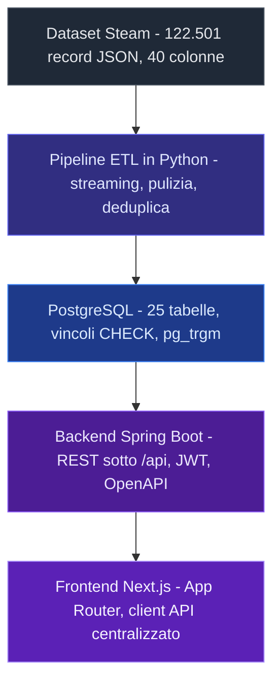

<div align="center">


<br/>


[](https://portfolio-imad-el-mir.vercel.app/it/projects/arcadium)
[](https://portfolio-imad-el-mir.vercel.app/videos/projects/arcadium/demo.mp4)

</div>

---

## Il problema

Chi gioca su PC accumula giochi molto piu in fretta di quanto riesca a giocarli. La libreria di Steam dice **cosa possiedi**, non **a che punto sei**: quali hai iniziato, quali hai lasciato dopo due ore, quali aspettano da un anno.

Arcadium nasce da li. E una piattaforma ispirata a Steam nell'aspetto ma diversa nello scopo: non serve a comprare giochi, serve a tenere in ordine quelli che hai gia.

<div align="center">

</div>

---

## I numeri

| | |
|---|---|
| **122.479** | giochi a catalogo, estratti da un dataset Steam di 460 MB |
| **25** | tabelle PostgreSQL in cinque aree, migrazioni Flyway V1-V7 |
| **65 s** | un full load completo, rieseguibile quante volte si vuole |
| **53** | test automatici: 49 unitari e 4 di caricamento su database |
| **1.178.560** | relazioni fra giochi e tag, ricaricabili senza un duplicato |

---

## Come funziona

Cinque strati, ognuno con una responsabilita sola. Il dato entra **una volta** dal dataset Steam e da li attraversa confini precisi.



Il confine piu importante e anche il piu banale da rispettare: **il frontend non conosce il database.** Non ha credenziali, non ha una connessione, non potrebbe raggiungerlo neanche volendo. Ogni dato passa da un endpoint documentato.

---

## Cosa sa fare

| | |
|---|---|
| **Catalogo con ricerca tollerante** | Filtri per testo, genere, piattaforma, prezzo e stato. La ricerca usa `pg_trgm`, quindi trova un titolo anche quando lo scrivi male |
| **Backlog con stati** | Mai giocato, in corso, finito, abbandonato. Le ore registrate alimentano la barra di completamento e le statistiche |
| **Achievement guidati dai dati** | Gli obiettivi non stanno nel codice: ognuno dichiara cosa misurare e con quale soglia. Aggiungerne uno e inserire una riga, non ricompilare |
| **Sincronizzazione Steam** | L'utente collega il proprio account e importa libreria e ore. Aggiunge e aggiorna, non cancella mai niente |
| **Bilingue a ogni livello** | Non solo l'interfaccia: colonne separate nel database per i valori mostrati, e messaggi del server scelti da `Accept-Language` |
| **Autenticazione JWT stateless** | Password cifrate, token firmato su ogni richiesta protetta, recupero password con token a scadenza. Gli endpoint pubblici sono cinque in tutto |

<div align="center">


</div>

---

## Le decisioni che contano

<details>
<summary><b>L'AppID di Steam come chiave primaria dei giochi</b></summary>

<br/>

E gia univoco nel dataset e resta stabile nel tempo. Generarne uno nostro avrebbe aggiunto una colonna e una traduzione mentale a ogni join, senza garantire niente di piu.

</details>

<details>
<summary><b>Lettura del JSON in streaming con <code>ijson</code></b></summary>

<br/>

Il dataset pesa 460 MB. Un `json.load()` lo tiene tutto in memoria e su una macchina normale non arriva in fondo. Leggerlo a pezzi costa qualche riga in piu e rende il caricamento indipendente dalla dimensione del file.

</details>

<details>
<summary><b>Caricamento idempotente con <code>ON CONFLICT DO UPDATE</code></b></summary>

<br/>

Un ETL che si puo rilanciare senza pensarci e un ETL che si usa davvero. La verifica non e teorica: **due full load consecutivi lasciano tutte e undici le tabelle con conteggi identici**, dai 122.479 giochi fino a 1.178.560 relazioni fra giochi e tag.

</details>

<details>
<summary><b>Migrazioni Flyway forward-only, riusate dal backend</b></summary>

<br/>

Le stesse migrazioni che costruiscono il database sono quelle che il backend applica all'avvio, con JPA in sola validazione. Nessuno schema generato a runtime, nessuna deriva fra la macchina di uno e quella di un altro.

</details>

<details>
<summary><b>Ricerca fuzzy dentro PostgreSQL invece di un motore esterno</b></summary>

<br/>

`pg_trgm` con indici dedicati copre il caso d'uso reale, che e un titolo scritto male. Un motore di ricerca a parte avrebbe aggiunto un servizio da far girare, sincronizzare e spiegare, per un vantaggio che qui nessuno avrebbe notato.

</details>

<details>
<summary><b>Chiave Steam fornita dall'utente e conservata cifrata</b></summary>

<br/>

La prima versione usava una chiave del server per leggere i dati di tutti. Ribaltare il modello significa che ogni utente accede ai propri dati con le proprie credenziali, e che il server non custodisce piu un segreto che vale per l'intera piattaforma.

</details>

---

## Dal dataset al database

La parte che ha richiesto piu lavoro non e stata scrivere codice, ma capire cosa ci fosse davvero nel file di partenza.

L'intestazione **fondeva due colonne in una**, e questo faceva slittare di una posizione tutti i valori fino a meta riga. L'**AppID** non compariva nei dati di riga: e stato ricostruito dal percorso `/apps/<AppID>/` presente negli URL delle immagini. **Sessantasei giochi** comparivano con piu rilevazioni dello stesso titolo, e per ognuno andava scelto quale snapshot tenere.

Alla fine restano 122.479 giochi con AppID tutti distinti, piu **ventidue righe con identificativo nullo**: casi che non era possibile determinare con certezza, e per i quali inventare un numero sarebbe stato peggio che ammettere il buco.

---

## Avviare il progetto

**Prerequisiti:** Docker Desktop attivo, e il dataset in `etl/data/steam_games.json` (non versionato).

Preparazione, una volta sola:

```bash
cp .env.demo.example .env
docker compose --profile etl run --rm etl
```

Avvio:

```bash
docker compose up -d --build
```

| | |
|---|---|
| Frontend | http://localhost:3000 |
| Backend / Swagger | http://localhost:8080/swagger-ui.html |
| Health | http://localhost:8080/actuator/health |

```bash
docker compose down       # ferma tutto, i dati restano nel volume
docker compose down -v    # ferma e CANCELLA anche i dati
```

I dati vivono nel volume `arcadium-pgdata` e sopravvivono ai riavvii: il caricamento va rifatto solo se il volume viene distrutto. Lo schema, Flyway V1-V7 piu i seed `R__`, lo applica il backend all'avvio.

> `PASSWORD_RESET_EXPOSE_TOKEN=true` e attivo **solo per la demo**, dove non c'e un server di posta: il token di reset torna nella risposta dell'API.

---

## Com'e organizzato

```
arcadium/
├── etl/          pipeline Python: estrazione, pulizia, caricamento
├── database/     configurazione Flyway
├── backend/      Spring Boot: API REST, sicurezza JWT, OpenAPI
├── frontend/     Next.js: App Router, client API, i18n
├── scripts/      migrazioni e utilita
└── docker-compose.yml
```

---

## Il gruppo

Arcadium e un **progetto di gruppo**: cinque persone, 253 commit.

[@Ghosty977](https://github.com/Ghosty977) · [@imadelmir](https://github.com/imadelmir) · [@VincenzoAnge](https://github.com/VincenzoAnge) · [@Yassin-En](https://github.com/Yassin-En) · [@stratmichele-lead](https://github.com/stratmichele-lead)

Chi ha scritto cosa e pubblico e verificabile: [grafico dei contributi](https://github.com/imadelmir/arcadium/graphs/contributors).

---

## Cosa e successo rimettendolo in piedi

L'ambiente Docker e stato ricostruito mesi dopo la consegna, e due cose si sono rotte subito.

**Flyway si e rifiutato di partire:** il volume del database conservava lo storico di due migrazioni che nel codice non esistevano piu. **Il container del frontend moriva a ogni avvio** perche l'immagine copiava i file come `root` e poi passava a un utente non privilegiato, che non poteva piu scrivere la cache di Next.

Nessuno dei due e un difetto della logica applicativa, ed e proprio questo il punto: un progetto funziona finche l'ambiente che gli sta sotto racconta la stessa storia del codice. Quando le due versioni divergono, la cosa migliore che possa capitare e che qualcosa si fermi **rumorosamente**, invece di continuare a girare fingendo che vada tutto bene.

---

<div align="center">

**[Il case study completo, con tutte le schermate](https://portfolio-imad-el-mir.vercel.app/it/projects/arcadium)**


</div>
